### App deployment. 

It is possible to deploy our own apps to a virtual machine via the terminals. 

### Files mangement & Navigation

we need to ensure that we have the correct files downloaded. In our case there are 2 files we need to download and extract. They are names: 
```
app
```
 and 
 ```
 environment
 ```

Due to security I won't share the files themselves. they need to be extracted and place din the correct file. 
The same file as our app deployment. in my case they can be seen as: 
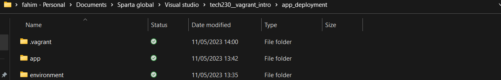

before we move onto the nect step make sure your in the correct file space in the terminal. Refer to my previous markdown files for more help but here is a quick rundown for navigation:

Use: 
```
ls
```
 Lists files and directories in the current directory. 1.1. ls -a: shows all files, including hidden ones

Use:
```
cd
```
This changes the current directory

additional help can be found:
``` https://www.digitalocean.com/community/tutorials/how-to-use-cd-pwd-and-ls-to-explore-the-file-system-on-a-linux-server ```


### Vagrant file changes

some adjustments need to be made our vagrant file. If there is not already one in our folder, we can copy in an exissting one or we can create a new one by using 
```
vagrant init
```
We also need a shell file, we will use 
```
provisions.sh and prov.sh
```
file in this file. we can create a new one or copy the old one. 

### Putting app file from local machine to Virtual machine

we need to put in aother line of code in the 
```
vagrantfile
```
the line we will add is: 
``` 
config.vm.synced_folder "app", "/home/vagrant/app"
```
Remember this line allows us to sync the files we added. 

Here is what the file should look like:
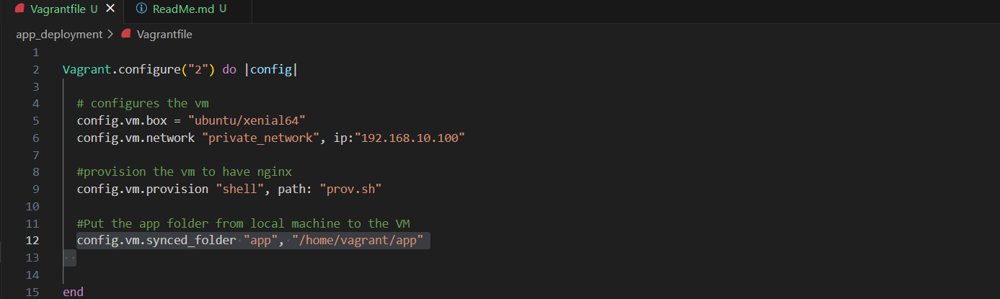


Now that the preparation is done, we can start the steps.


## Step 1: Starting up vagrant

we need to use 
```
Vagrant up
``` 
in the terminal in order to start the VirtualMachine. 


## step 2: Using gitbash terminal 

on the gitbash terminal we need to arrive to the right location. Use the commands above (ls and cd) to navigate. 
Once arrived;  use 
```
vagrant ssh
``` 
to access the VM through the gitbash terminal. Should look something like this:
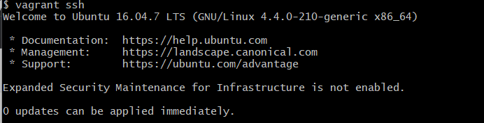

Here i recomend checking the files, use:
```
ls
```
and the file should hopefully be highlighted or it should appear. 
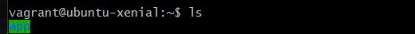

now go into the ```"app"``` folder, this is so we can access it's contents.
use 
```
cd app
```

Furthermore we can use 
```
pwd
```
to check the contents. 

## step 3: Installing nodejs

The next steps are pretty straight forward and can take some time to complete depending on your system capabilities.
We need to run 
```
sudo apt-get install nodejs
```
This installs nodejs. It should result in something similar to: 
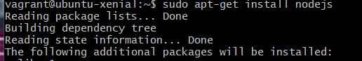
followed by alot of code.

we can check the version via
```
nodejs --version
```

## step 4: installing python softwares

Next we need to install another package using the following command: 
```
sudo apt-get install python-software-properties
```

hopefully resulting in something similar to: 
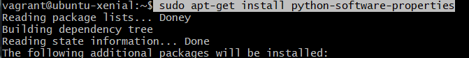
if a confirmation is required, confirm it. 

## step 5: Retrieving the software

Next we need to use a URL in order to retrieve the package. the URL is: 
```
"https://deb.nodesource.com/setup_6.x"
```

combine this with the following line of code:
```
curl -sL https://deb.nodesource.com/setup_6.x | sudo -E bash -
```

resulting in:
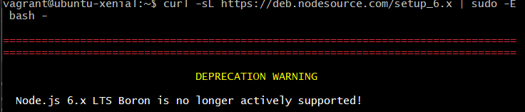

## step 6: Installing

use:
```
sudo apt-get install -y nodejs
```
and confirm it. resulting in: 
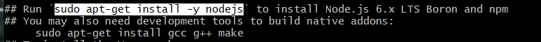

use:
```
sudo apt-get install nodejs -y
```
there is no need to confirm this one as we used
```
-y
```
Note: this can be used in many places not just here. 

use
```
sudo npm install pm2 -g
```
resulting in: 
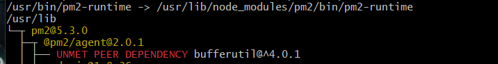

in order to verify it has worked we can enter the IP address followed by the port into a browswer,
```
"192.168.10.100:3000"
```
Resulting in:
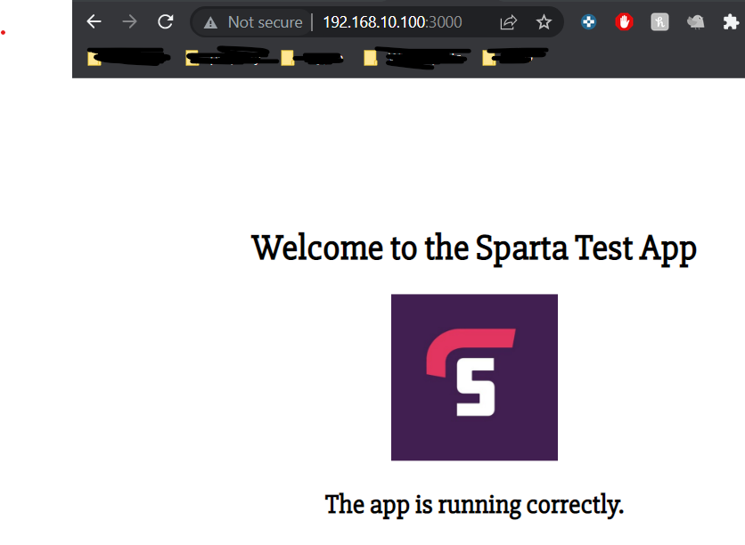

Provisions file in full:
The aim of this is to automate the process we have above.

``` 
sudo apt-get update -y

sudo apt-get upgrade -y

sudo apt-get install nginx -y

sudo systemctl start nginx

# Install Python properties 
sudo apt-get install python-software-properties -y

# Install Node.js v14.x
curl -sL https://deb.nodesource.com/setup_6.x | sudo -E bash -
sudo apt-get install nodejs -y

sudo npm install pm2 -g

cd /home/vagrant/app 

# Install dependencies from package.json
npm install
# Start the app
node app.js
```


# Connecting the DB machine to the APP. 

(friday task)

## Preparations

we will begin by creating a new folder and copying in our app, environment and a couple other things. 

Here they are:
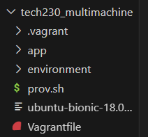

these were copied from before.

### step 1: Changing the provisions file

we will comment out certain lines so that it can run properly. by the end the file should look similar to this:

```
sudo apt-get update -y

sudo apt-get upgrade -y

sudo apt-get install nginx -y

# Install Python properties 
sudo apt-get install python-software-properties -y

# Install Node.js v14.x
curl -sL https://deb.nodesource.com/setup_12.x | sudo -E bash -
sudo apt-get install nodejs -y

sudo npm install pm2 -g
```
we changed the value of setup from '6' to '12'. it cause us problems. 

### step 2: Change the vagrantfile

we need to change this file quite abit. We will change the following:

introduce a new 'do' block this will introduce the 'app'. 
```
config.vm.define "app" do |app|
  # configures the vm
    app.vm.box = "ubuntu/bionic64"
    app.vm.network "private_network", ip:"192.168.10.100"

  #Put the app folder from local machine to the VM
    app.vm.synced_folder "app", "/home/vagrant/app"

  #provision the vm to have nginx
    app.vm.provision "shell", path: "prov.sh", privileged: false
  end
```
we will also introduce a 'db' do block aswell. By the end the vgrant file should look like this:
```
#configure 2 vms
Vagrant.configure("2") do |config|

  config.vm.define "app" do |app|
  # configures the vm
    app.vm.box = "ubuntu/bionic64"
    app.vm.network "private_network", ip:"192.168.10.100"

  #Put the app folder from local machine to the VM
    app.vm.synced_folder "app", "/home/vagrant/app"

  #provision the vm to have nginx
    app.vm.provision "shell", path: "prov.sh", privileged: false
  end

  config.vm.define "db" do |db|

    db.vm.box = "ubuntu/bionic64"
    db.vm.network "private_network", ip:"192.168.10.150"
    db.vm.synced_folder "environment", "/home/vagrant/environment"


  end
end
```
### Step 3: open 2 terminals

open 2 Gitbash terminals, One will be used to access the 'app' and the other the 'db', Remember to open as admin. we then need to use 
```
vagrant up
```
on the terminal to launch both virtual machines. It may take a while to load. We are using "Bionic64", there are many versiond of Linux, a list can be found at the end of the file. 

A way to cofirm this is to see 2 virtual machines running on virtualbox. 

Congrats! You have 2 Vms running!

### step 4: login to both gitbash terminals

Remember file mangement is key, so make sure your in the right location and you have the correct path. Consider copying it directly from the VScode terminal if that helps. 

Now that we have arrived at the correct location, we need to decide which terminal will run 'app' and which will run 'db'. Use:
```
vagrant ssh app
```
and
```
vagrant ssh db
```
to go into each file.
we can use 
```
ls
```
(refer to file mangement above for more commands)
This will help us identify which terminal is in which machine. 

### Step 5: Update

inside the db terminal, use the following code:
```
sudo apt-get update -y
```
this will update and automatically confirms it.

### Step 6: Upgrade

In the same terminal, upgrdae it through using:
```
sudo apt-get upgrade -y
```
The pacakges are now grabbed and ready to use. 

### step 7: Run codes

In the db terminal enter the following:
```
sudo apt-get adv --keyserver hkp://keyserver.ubuntu.com:80 --recv D68FA50FEA312927
```
and the next:
```
echo "deb https://repo.mongodb.org/apt/ubuntu xenial/mongodb-org/3.2 multiverse" sudo tee /etc/apt/sources.list.d/mongodb-org-3.2.list 
```
### step 8 (check): update and upgrade checks

Since we installed a package, it is ood practice to update it and upgrade it. simple run these commands:
```
sudo apt-get update -y
```
and 
```
sudo apt-get upgrade -y
```

### Step 9: installing mongodb
run the code:
```
sudo apt-get install -y mongodb-org=3.2.20 mongodb-org-server=3.2.20 mongodb-org-shell=3.2.20 mongodb-org-mongos=3.2.20 mongodb-org-tools=3.2.20
```
this installs other things as well as mongodb. This version is 3.2. 

### Step 10 (check): Check the version
We can run the following code to check which version of mongodb we have:
```
mongod --version
```

### step 11: launch and start mongodb.
we need to start it via:
```
sudo systemctl start mongod
```
We need to enable it via:
```
sudo systemctl enable mongod
```
we can check the status via:
```
sudo systemctl status mongod
```
Hopefully it should result in this:
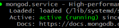


## Connecting the VM's
the mongo config file needs to be altered

### step 1: Allow access
enter this: in order to allow access
```
sudo nano /etc/mongod.conf
```

### step 2: Coding the VM via Git bash
The bindIP needs to be changed.
Do the following  change:
```
"IP: 0.0.0.0"
```
this allows anyone to access

### Step 3: Restart and enable

use the following:
```
$ sudo systemctl restart mongod
```
```
$ sudo systemctl enable mongod
```

### Step 4: New terminal:

open a new terminal and enter these:
```
$ vagrant ssh app
```
To allow access from any user, use this:
```
$ sudo nano .bashrc
```

### Step 5: Export 

we need to add the following line at the end of the file:
```
export DB_HOST=mongodb://192.168.10.150:27017/posts (right at the bottom)
```
seen here:
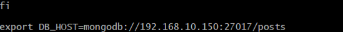

### step 6: Execute and install

now we need to execute and install, use these:
```
$ source .bashrc
```
```
$ npm install
```

### Step 7: Run application

use:
```
node app.js
```
to run the program.

### step 8: confirm
navigate to
```
192.168.10.100:3000/posts
```
where we should have:
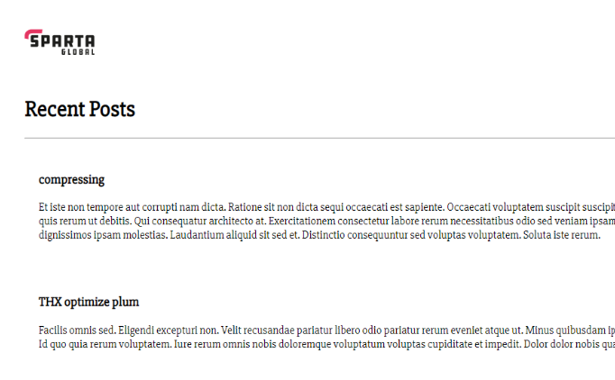

Success!

## Addtional comments:
It is possible to create variables in the Git Bash terminal, (within the VM)
here is an example: 
```
my_var = hi
echo $my_var
```


However these variable will not save if we close the terminal. In order to create and/or view the variables that remains we need to use:
```
sudo nano .bashrc
```
also;
```
Sudo kill <p id>
```
this kills the program.

```
sudo kill -9
```
this is a more forceful way to kill the program.

### Useful/ Key commands

Throughout our work we need to save, we use
```
cntrl + x
```
for this. 

## Confirmation

in order to check if it has worked, we can go to our web browser and type:
```
http://192.168.10.100:3000/posts
```
here is the result:

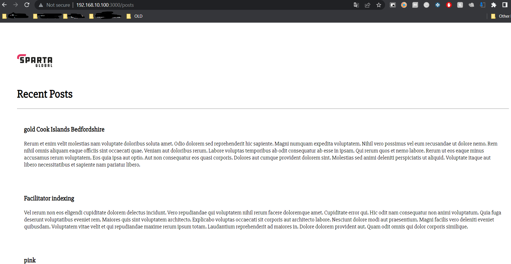


## Important lessons ive learnt
1. File mangement is key. Most the times i had an error was because of my bad file manegement.

2. Syntax is important. simple mistakes like typos can cause huge headaches. 

3. Always proof read code before launching/ running. 


### Additional material/ Further reading

Here are some interesting and useful read:
```
https://learn.microsoft.com/en-us/powershell/module/microsoft.powershell.core/about/about_environment_variables?view=powershell-7.3
```
This is a very useful piece of material, here are some things it covers:
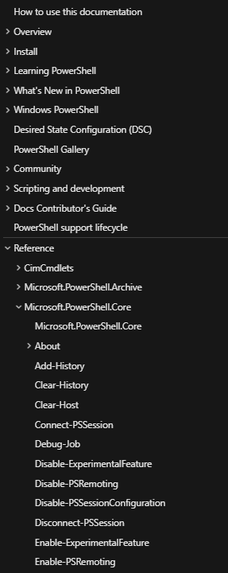

```
https://medium.com/chingu/an-introduction-to-environment-variables-and-how-to-use-them-f602f66d15fa
```


